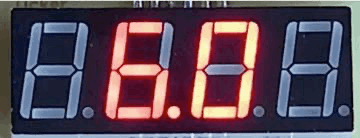

# Manual de uso

## Descripción

El aparato cuenta con dos botones.

- El botón A. es el más gránde y está situado a la derecha
- El botón B. es el más pequeño y está situado a la izquierda

bajo ellos está el interruptor que permite encender el aparato.

## Modos de operacion

Existen 3 modoso de opaeracion
(estrategias de operacion en el codigo fuente).

Se activan manteniendo pulsado un botón durante el arranque
(Pulsar un botón -o no- mientras se activa el interruptor).

| Modo         | Botón         | Descripción                                                                                             |
| ------------ | ------------- | ------------------------------------------------------------------------------------------------------- |
| Contador     | B (izquierdo) | Contaodr de pulsaciones                                                                                 |
| Metrónomo    | A (derecho)   | Marca el tempo (sin sonido)                                                                             |
| Temporizador | - ninguno -   | Reloj de cuenta regresiva para cocina o para [Pomodoro](https://es.wikipedia.org/wiki/Técnica_Pomodoro) |

Estos modos se describen a continuación.

## Contador

Modo original de este proyecto y que le da nombre. Permite contar cosas sin llevar la cuenta mentalmente.

Con el botón A se incrementa la cuenta, con el botón B se decrementa la cuenta.

Para resetear la cuenta simplemente reinicie el aparato con el interruptor (manteniendo el botón B apretado).

Se pueden contar cosas hasta el límite de la pantalla: 9.999 (o -999 en negativo)

## Metrónomo

Imita un [Metrónomo](https://es.wikipedia.org/wiki/Metrónomo) convencional, pero sin sonido porque
no disponemos de un buzzer.

En el centro de la pantalla se muestran los _beats_ por segundo.
Este número se puede incrementar con el botón A o decrementar con el botón B.

Los puntos del display, junto con los segmentos verticales, marcan el tempo.
Cada vez que se enciende uno de los extremos es un _beat_ y marca la duración de una negra.
Los puntos marcan la duración de una semicorchea (1/4)

## Temporizador

Al encenderse el reloj marca `2 5.0 0`
